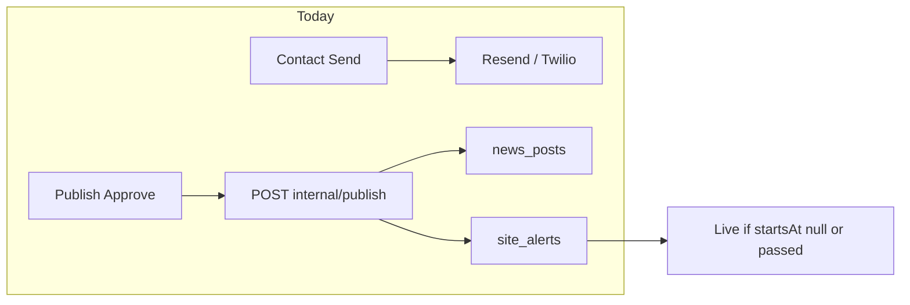
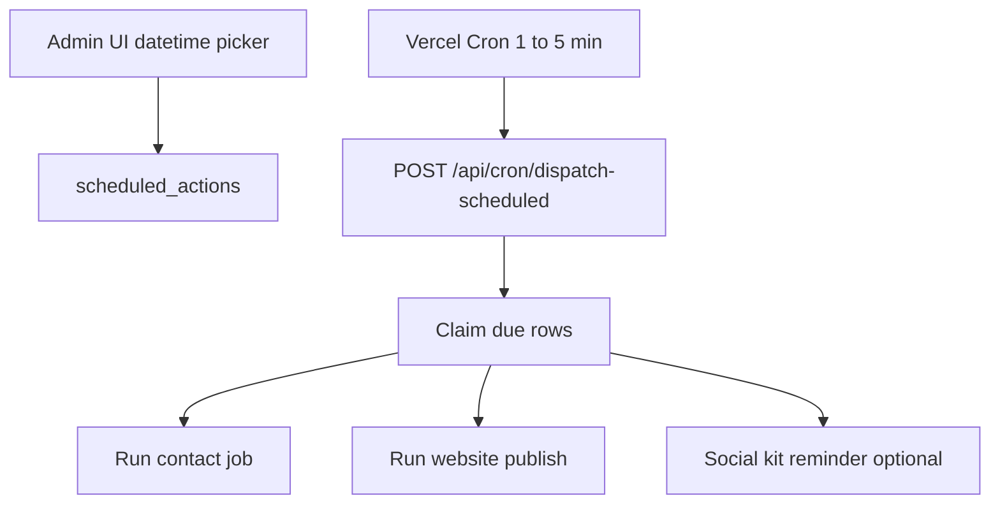

# Scheduled communications and publish (design)

This document describes **what exists today**, architecture for scheduled delivery, and operational notes. **Scheduling is implemented** in admin (`scheduled_actions`, `/scheduled`, cron dispatcher); see env `CRON_SECRET` in [setup-and-capabilities.md](./setup-and-capabilities.md).

Setup for Twilio, Resend, and publish secrets: [integrations-setup.md](./integrations-setup.md).

---

## Scope

**In scope (target):**

- Schedule **Contact players** jobs (all channels) for a future `run_at`.
- Schedule **Publish** approve (website news, site alert, flyer) instead of immediate approve.
- Optional **social kit reminder** (notify admins to post Instagram/YouTube manually)—still no auto-post APIs.

**Out of scope:**

- Automated Instagram / YouTube posting.
- Replacing Twilio/Resend; reuse existing send/publish code at fire time.

**Timezone:** **America/New_York** for admin UI and site alerts (matches bdl-website `app/lib/site/alerts.ts`).

---

## Current behavior

| Surface | When it runs | Scheduling support |
|---------|--------------|-------------------|
| Contact players | Immediately when admin confirms send ([`createAndSendContactJob`](../app/lib/contact/jobs.ts)) | None; `contact_jobs` has no `scheduled_at` |
| Publish **Approve** | Immediate HTTP POST to website ([`approvePublishPost`](../app/lib/publish/mutations.ts)) | None |
| Site alert bar | Visible when `starts_at` ≤ now ≤ `ends_at` (computed on read) | Website + builder support windows; admin composer sends **`startsAt: null`** ([`website-client.ts`](../app/lib/publish/website-client.ts)) → alert goes **live on approve** |
| News posts | `published: true` sets `publishedAt` to **now** on publish | No future go-live |
| Social kit | Shown after approve; manual checkboxes | None |

There is **no Vercel Cron** in [`vercel.json`](../vercel.json) today.

---

## Recommended architecture

Single **scheduled action** queue in **admin Postgres**, one **dispatcher** triggered by cron, reuse existing send/publish logic when `run_at` is due.

### New table: `scheduled_actions` (admin)

Suggested columns:

| Column | Type | Notes |
|--------|------|--------|
| `id` | uuid | PK |
| `created_by_admin_email` | text | Who scheduled it |
| `run_at` | timestamptz | Fire time (store UTC) |
| `timezone` | text | Default `America/New_York` for display/audit |
| `action_type` | text | `contact_job` \| `publish_post` \| `social_reminder` |
| `payload` | jsonb | Frozen snapshot or refs (job draft, publish post id, etc.) |
| `status` | text | `scheduled` \| `running` \| `completed` \| `failed` \| `cancelled` |
| `idempotency_key` | text | Optional unique guard |
| `error_message` | text | Last failure |
| `completed_at` | timestamptz | |

Index: `(status, run_at)` where `status = 'scheduled'`.

Migration under `drizzle/` following existing patterns.

### Dispatcher

1. Add **Vercel Cron** in `vercel.json` (e.g. every 5 minutes) calling `/api/cron/dispatch-scheduled`.
2. Secure with `CRON_SECRET` (header check) or Vercel’s cron authorization.
3. In one transaction (or per-row): `SELECT … FOR UPDATE SKIP LOCKED` for rows where `status = 'scheduled'` and `run_at <= now()`.
4. Set `running`, invoke handler by `action_type`, then `completed` or `failed`.
5. Retry policy: optional manual “Retry” in admin UI for `failed`; avoid infinite auto-retry without backoff.

### Handler: `contact_job`

- At schedule time: persist audience + message as today (or reference a draft `contact_jobs` row in `draft` status).
- At `run_at`: call existing send path in [`jobs.ts`](../app/lib/contact/jobs.ts) (same Twilio/Resend providers).
- Still enforce [`CONTACT_MAX_RECIPIENTS`](../app/lib/contact/jobs.ts) (default **50**). Larger blasts may need **batching** or a background worker (similar to video-tools).

**Twilio scheduling:** Prefer **dispatcher sends at `run_at`** (Option A)—one code path for email, SMS, WhatsApp, and publish. Twilio’s native `sendAt` (Option B) splits logic and does not help email or website publish.

**Resend:** Dispatcher sends at `run_at`; use Resend’s scheduled API only if you want provider-side queueing (optional).

### Handler: `publish_post`

- At schedule time: keep `publish_posts.status = 'draft'` (or new `scheduled`) until fire.
- At `run_at`: run [`approvePublishPost`](../app/lib/publish/mutations.ts) logic (website call + social kit generation).

**Admin UI / payload changes:**

- Datetime for **site alert start** (`startsAt`) — pass through [`buildWebsitePublishPayload`](../app/lib/publish/website-client.ts) instead of hard-coded `null`.
- Datetime for **news go-live** — today website sets `publishedAt = now()` when `published: true`.

**Website changes (bdl-website):**

- Extend internal publish input to accept optional **`news.publishAt`** (or schedule with `published: false` until dispatcher sets `published: true` and `publishedAt` at fire time—clearer for public listings).
- Already supports **`siteAlert.startsAt`** / `endsAt` strings (Eastern local format); wire from admin composer.
- **No website cron** required for alerts if status remains read-time from `starts_at` / `ends_at`.

### Handler: `social_reminder`

- Lightweight: email to `created_by_admin_email` (or board list) via existing Resend helpers, or in-app notification only.
- Reminder text: links to publish post + social kit copy; admin still posts IG/YT manually.

---

## UI changes (admin)

| Area | Change |
|------|--------|
| [`ContactPlayersDialog`](../app/components/contact/ContactPlayersDialog.tsx) | **Send now** vs **Schedule**; datetime-local (Eastern); list/cancel scheduled jobs |
| Publish composer [`/publish/[id]`](../app/publish) | **Approve now** vs **Schedule publish**; fields for alert start, news go-live, alert end (partially exists as `siteAlertEndsAt`) |
| New page or section | **Scheduled** queue: upcoming / failed / cancel |

---

## Effort estimate

| Workstream | Rough effort |
|------------|----------------|
| Schema + cron route + auth | 1–2 days |
| Contact scheduling UI + API | 1–2 days |
| Publish scheduling + website API (`startsAt`, news timing) | 2–3 days |
| Social reminder | 0.5–1 day |
| Tests (TZ edges, DST, idempotency, cancel) | 1–2 days |
| **Total** | **~1–2 weeks** preview-first |

---

## Risks and decisions

| Topic | Notes |
|-------|--------|
| **Serverless timeout** | Contact job for 50 recipients runs inline today; cron handler may hit Vercel limits—may need queue + worker for large campaigns |
| **Preview vs prod** | Do not fire real Twilio/Resend on preview without explicit env; prefer `CONTACT_DRY_RUN=1` on preview |
| **Cancel / edit** | Product decision: editable until `run_at`? |
| **Clock** | Store UTC; display Eastern; use same parsers as site alerts where possible |
| **Idempotency** | Prevent double-fire if cron overlaps (row lock + status transitions) |
| **Partial publish failure** | Website publish is multi-target (flyer, news, alert)—define all-or-nothing vs per-target status |

---

## Suggested implementation order

1. **Schema + dispatcher** with a no-op or test action; cron on preview only.
2. **Publish scheduling** + website `startsAt` + news go-live (visible on site without new contact work).
3. **Contact scheduling** (depends on Twilio/Resend setup from [integrations-setup.md](./integrations-setup.md)).
4. **Social reminder** last.

---

## Test plan (when built)

1. Schedule publish 5 minutes ahead → site alert **scheduled** until `startsAt`, then **live** on page load.
2. Schedule news → not listed until go-live; then appears with correct `publishedAt`.
3. Schedule email to self → Resend receives at `run_at` (preview dry-run first).
4. Schedule SMS (prod, small cohort) → Twilio SID on recipient row.
5. Cancel scheduled row before `run_at` → dispatcher skips.
6. DST boundary (spring/fall) for Eastern datetime picker.

---

## Related docs

- [integrations-setup.md](./integrations-setup.md) — Twilio, Resend, publish env
- [setup-and-capabilities.md](./setup-and-capabilities.md) — current feature matrix
